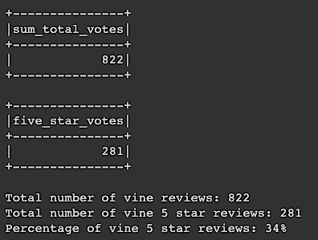
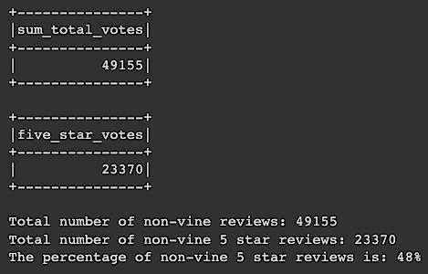

# Amazon Vine Analysis

## Overview

For this project we analyzed the Amazon reviews written by members of the paid Amazon Vine program. The Amazon Vine program is a service that allows manufacturers and publishers to receive reviews for their products.

For our analysis, we chose the Musical Instruments dataset of reviews.

The following tools were used for this analysis:

- PySpark: to perform the ETL process to extract the dataset, transform the data, connect to an AWS RDS instance, and load the transformed data into pgAdmin.
- Pandas: to determine if there was any bias toward favorable reviews from Vine members in our dataset.

To eliminate bad data and to ensure the reviews were a good quality, only products that had more than 20 reviews and where more than 50% of them were helpful were included in our analysis.

## Results

To perform our analysis, the data was split into reviews that were made by paid vine reviews and non-paid reviews.

The following image shows the results for Vine paid reviews:

The results for reviews that were not paid for by Vine are shown here:

Our analysis addressed the following questions:

- How many Vine reviews were there?
  <b>822</b>

- How many Non-Vine reviews were there?
  <b>49,155</b>

- How many Vine reviews were 5 stars?
  <b>281</b>

- How many non-Vine reviews were 5 stars?
  <b>23,370</b>

- What percentage of Vine reviews were 5 stars?
  <b>34%</b>

- What percentage of non-Vine reviews were 5 stars?
  <b>48%</b>

## Summary

### Initial Analysis

By looking at the percentage of reviews that were 5 stars, non-vine reviews have a significant higher percentage then ones from paid reviewers.

It is possible that reviews are biased away from 5 stars since they are taking more seriously than those from reviewers that are not paid.

If so, this would mean that even though there are a lot less paid reviews, those reviews would be an even higher quality, overall.

### Recommended Further Analysis

To reduce bias, we could reduce the dataset of non-vine users to be equal to vine users and re-run the analysis to see if the percentage of 5 star reviews is closer.

If there is still a significant difference we may want to determine if the Vine reviews should be weighted more or less than the Non-Vine reviews taking the percentage of Vine vs. Non-Vine reviews that were helpful.

For example, if we found that 90% of Vine reviews were helpful but only 30% of Non-Vine reviews were helpful than it may pay to use the Vine reviews over the Non-Vine reviews when making decisions on whether to buy a product even if there are not nearly as many Vine reviews overall.
